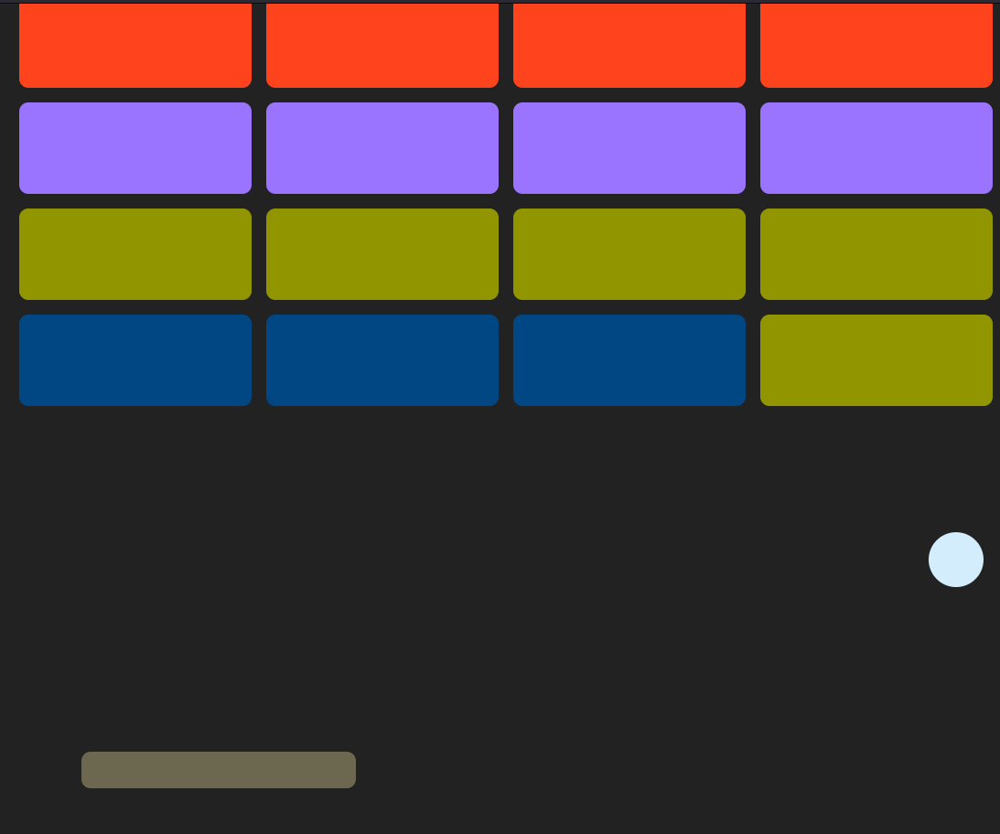

# Arkanoid Game with pure JS

A simple but responsive arkanoid game made with pure js just for improve my dom manipulation skills 

<p align="center">
    
</p>


## Instalation ⚙️

Just clone this repository

```bash
    git clone git@github.com:mansulol/Arkanoid-with-JS.git

    cd Arkanoid-with-JS
```

## Tecnologies 👨🏾‍💻

<p align="center">


</p>

## Author 🖊️

Mansour [mansour.lolo.04@gmail.com](mansour.lolo.04@gmail.com)

made with 🩷 by Mansour
  